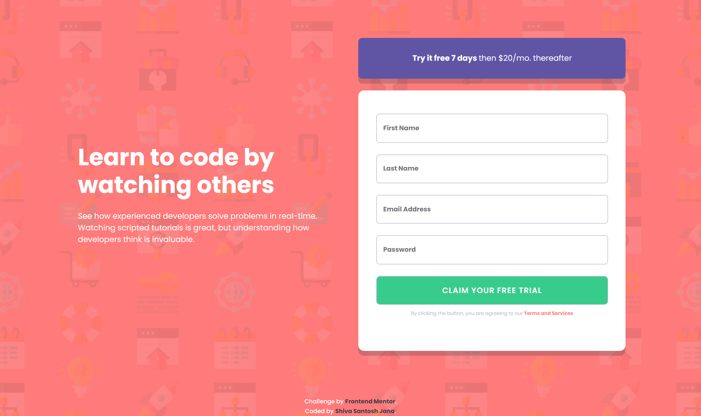

# Frontend Mentor - Intro component with sign up form solution

This is a solution to the [Intro component with sign up form challenge on Frontend Mentor](https://www.frontendmentor.io/challenges/intro-component-with-signup-form-5cf91bd49edda32581d28fd1). Frontend Mentor challenges help you improve your coding skills by building realistic projects.

## Table of contents

- [Overview](#overview)
  - [The challenge](#the-challenge)
  - [Screenshots](#screenshots)
  - [Links](#links)
- [My process](#my-process)
  - [Built with](#built-with)
  - [What I learned](#what-i-learned)
  - [Continued development](#continued-development)
- [Author](#author)

## Overview

### The challenge

Users should be able to:

- View the optimal layout for the site depending on their device's screen size
- See hover states for all interactive elements on the page
- Receive an error message when the `form` is submitted if:
  - Any `input` field is empty. The message for this error should say _"[Field Name] cannot be empty"_
  - The email address is not formatted correctly (i.e. a correct email address should have this structure: `name@host.tld`). The message for this error should say _"Looks like this is not an email"_

### Screenshots

Desktop version

Mobile version

### Links

- Solution URL: [Code on GitHub](https://github.com/santu369/frontendmentor-intro-component-with-signup-form)
- Live Site URL: [GitHub Pages Live URL](https://santu369.github.io/frontendmentor-intro-component-with-signup-form/dist)

## My process

Experimented with css reset. CSS reset strips away all the default styles. All the styling need to be done using customized css. This is helpful to make the website look similar on most of the browsers. Worked on the design starting from mobile layout first and added media queries for handling bigger screen sizes. Used SAAS for styling. Experimented with Parcel Bundler and it worked out fine.

### Built with

- Semantic HTML5 markup
- CSS custom properties
- Flexbox
- CSS Grid
- Mobile-first workflow
- JS for input validations
- BEM Methodology
- SASS
- Parcel Bundler

### What I learned

Minimizing and Optimizing code is considered a must for delivering quality web sites. Parcel is one such bundler which optimizes the code. It workes seamlessly with sass, provides hot reload as well. This doesn't require Live Server Plugin in vs code. I have linked the sass file directly in the index.html file and installed both sass and parcel bundler via npm. `parcel index.html` compiles the sass to css, hooks up js and is so fast.

Parcel creates .cache folder while processing, this is not required and can be deleted once development is complete. I've setup some npm scripts for the same.

Added some js to toggle the password field to show/hide it on focus. This behavior is seen in most login/signup forms these days.

### Continued development

Will continue using sass along with parcel. Would also check on browsersync and webpack going forward. Wil experiment with CSS Normalize in next projects.

### Useful resources

- [Sass](https://sass-lang.com/) - Installing and Learning Sass.
- [BEM](https://en.bem.info/methodology/quick-start/) - Quick Start with BEM.
- [W3C Markup Validation Service](https://validator.w3.org/) - Validator for checking the markup validity of Web documents in HTML, XHTML, SMIL, MathML, etc.
- [W3C CSS Validation Service](https://jigsaw.w3.org/css-validator/) - Check Cascading Style Sheets (CSS) and (X)HTML documents with style sheets.
- [PerfectPixel by WellDoneCode](https://www.welldonecode.com/perfectpixel/) - Extension helps to develop websites with pixel perfect accuracy based on design pictures.
- [Parcel Bundler](https://parceljs.org/getting_started.html) - Getting started with parcel bundler
- [Reset CSS](https://meyerweb.com/eric/tools/css/reset/) - Strips away all the default browser styling.

## Author

- Website - [Shiva Santosh Jana](https://santu369.github.io/FreeCodeCamp-PersonalPortfolioWebpage)
- Frontend Mentor - [@santu369](https://www.frontendmentor.io/profile/santu369)
- Twitter - [@santu69](https://www.twitter.com/santu69)
